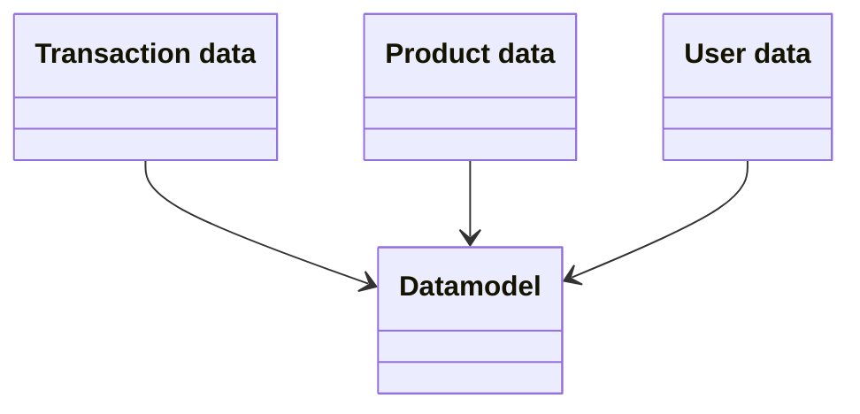

## Sift Lab - Data Specification

A datamodel in Sift Lab is made up of three data tables. Each line in the interaction table is linked to a specific user and item in the item and user tables. 





### Data encoding

Data must be encoded as UTF-8 + RFC 4180 (see more info at [https://tools.ietf.org/html/rfc4180](https://tools.ietf.org/html/rfc4180)). Below are some specifics regarding the cell and row formatting.

| Case      | Example |
| ----------- | ----------- |
| Line break      | \n   |
| Quotes must be escaped  | “14”” TV”  |
| Cell wrap with double if the value contains , or \n | “Hello, world” |
| Number, avoid space and comma. | 12345678.9 |
| Timestamp/date, use unix timestamp or formatted date string. | 1591718519 or “2020-03-17 15:01:02” or “2006-01-02T15:04:05-0700” |


A valid example

```
id,value,number
1,"Hello, world!",123.45
2,"14"" TV",123.45
```

### Transaction data
Provide a file containing transactional data between your products and users. Usually represents order rows.

If necessary, you may provide an additional file with data that is associated with an order number. An example would be an order header containing shipping cost, payment fee etc. In this case, provide an order number in the transactional data, and use the order number as the unique identifier in the orders file. 

| Field | Role | Description |
| ----- | ---- | ----- |
| user | User (required) | Must uniquely identify a user, same as in User table. |
| id | Category (required) | Must uniquely identify a transaction/order row. Can be created from combining other fields. | 
| item | Item (required) |Must uniquely identify an item, same as in Item table | 
| date_time | Timestamp (required) | Timestamp at which the interaction occurred. |
| revenue | Revenue | Revenue of transaction/order row (This is ex VAT) | 
| quantity | Quantity | Number columns must be adjusted for quantity, ex the Revenue/Margin column must be equal to the Total Revenue/Margin for that interaction. | 
| order_id | Category | Must uniquely identify an order | 
| returned_quantity | Number | negative in the case of returns (placed as a new order with negative quantity) | 
| discount_percent | Number | Discount for all items in the row. Also called voucher/promo_code (format 25 not 0.25, divide by 100 in computations) | 
| tax_percent | Number | format 25 not 0.25, divide by 100 in computations | 
| payment_method | Category |  | 
| country | Category |  | 
| market | Category |  | 
| store | Category |  | 
| sales_channel | Category | ex. retail, ecomm, etc. | 
| currency | Category | SEK, USD, EUR | 
| exchange_rate | Number | Exchange rate for the currence at the time the purchase was made | 
| campaign | Category |  | 
| utm_tag | Category |  | 
| days_to_delivery | Number | Days from placed order to received shipment | 
| coupons | Category |  | 
| order_status | Category |  | 
| is_return | Category | Yes/No/Partially | 
| cancelled_quantity | Number |  | 
| ship_to_country | Category |  | 
| ship_to_city | Category |  | 
| handling_fee | Number | cost of handling the order | 
| shipping_fee | Number | cost of shipping | 
| shipping_method | Category | Method used, such as: Home delivery, Click & Collect | 
| shipping_partner | Category | Transportation service provider | 
| full_price | Number |  | 
| revenue_after_returns | Number |  | 
| freight_cost | Number |  | 
| margin_gm1 | Number | GM1 = Difference between frt rcvd and paid | 
| margin_gm2 | Number | GM2 = Gross margin after labour | 
| margin_gm3 | Number | GM3 = Gross margin after deductions | 
| margin_gm4 | Number | GM4 = Gross margin after commission | 
| margin_gm5 | Number | GM5 = Gross margin after interest | 
| margin_gm6 | Number | GM6 = Gross margin after insurance | 
| ...< ANY > |  Number, Category | Additional metadata may be added that you find interesting to examine in our analytics. | 

### Product data
Provide a file containing product (item) meta data. Make sure all product ids that are present in the transactions are also present in this file.

Categorical data in hierarchical structure should be added as separate columns: `category_1`, `category_2`, etc. If a product can have multiple categories but without hierarchy, provide them as a semi-colon separated string: `“categoryA;categoryC:categoryE”`. An example would be genres for a movie, as a movie can be associated with multiple genres in no particular order.

| Field | Role | Description |
| ----- | ---- | ----- |
| item | Item (required) | Must uniquely identify a product, same as in transactions. This is what the machine learning trains on and is what will be used in recommendations | 
| title | Format | The displayed name that will be associated with the product. |
| image | Image | URL to product image. |
| link | Category | URL to product page |
| sales_price | Number | Current selling price including discounts |
| full_price | Number | Price without any discounts |
| availability | Category | Yes / No |
| in_stock | Number | How many units are sellable in stock |
| sku | Category | Stock keeping unit (e.g. specific shirt in a certain color and size) |
| product_variant | Category | Variation specified product, usually product page (e.g. specific shirt in a certain color, any size) |
| parent_product | Category | The named product (e.g. specific shirt in any color or size) |
| category_level_1 | Category | The highest category level |
| category_level_2 | Category | 2:nd highest category level |
| category_level_3 | Category | 3:rd highest category level |
| category_level_4 | Category | 4:th highest category level |
| category_level_5,6,7... | Category | etc. |
| size | Category | Standard size format (S/M/L, M6/M8/M10, 90/120/140) |
| cogs | Number | Cost of goods |
| description | Category | Description of item. Limited to 255 characters. |
| color | Category |  |
| brand | Category |  |
| county_of_origin | Category | Where the product is produced |
| condition | Category | Such as New or Used |
| collection | Category | such as SS19, SS20, SS21 etc. |
| supplier | Category |  |
| shipping_weight | Number |  |
| product_launch | Timestamp | Date for product release |
| data_source | Category | In the case of multiple datasources, this identifies which source the data is coming from.  |
| ml_blocked | - | Blocks specific items from the machine learning. Not the same as excluding them by filtration. |
| ...< ANY > |  Number, Category | Additional metadata may be added that you find interesting to examine in our analytics. | 

### User data
Provide a file containing user meta data. Make sure all user ids that are present in the transactions are also present in this file.

In order to have deletes propagate to our side, provide users with empty data on all fields except id or a `“is_deleted”` field that we will use to clear all metadata.

| Field | Data type | Note |
| ----- | ---- | ----- |
| user | User (required) | Must uniquely identify a user, same as in transactions. |
| market | Category |  |
| country | Category |  |
| country_code | Category |  |
| region | Category |  |
| area | Category |  |
| city | Category |  |
| disctrict | Category |  |
| zip_code | Category |  |
| customer_store | Category |  |
| first_name | Category |  |
| last_name | Category |  |
| email | Email |  |
| age | Number |  |
| birthdate | Timestamp |  |
| gender | Category |  |
| phone_number | Category |  |
| control_group | Number | Used during tests, can be imported or generated. |
| mosaic_group | Category |  |
| nps | Category |  |
| accepts_communication | Category | Can be several fields depending on setup. Used to identify users that can be communicated with by Yes/No. |
| subscribe_date | Timestamp |  |
| unsubscribe_date | Timestamp |  |
| discount_cohort | Category |  |
| returned_revenue_percent_cohort | Category |  |
| returned_revenue_cohort | Category |  |
| revenue_cohort | Category |  |
| returned_quantity_percentage_cohort | Category |  |
| quantity_sum | Number |  |
| quantity_sum_returned | Number |  |
| quantity_return_percentage | Number |  |
| total_value_paid | Number |  |
| total_value_returned | Number |  |
| total_value_return_percentage | Number |  |
| average_discount | Number |  |
| customer_net_value | Number |  |
| registration_date | Timestamp |  |
| ...< ANY > |  Number, Category | Additional metadata may be added that you find interesting to examine in our analytics. | 

