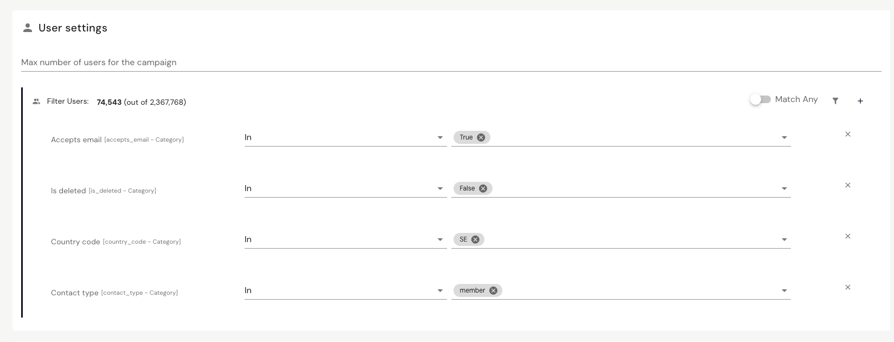
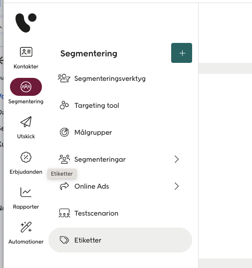
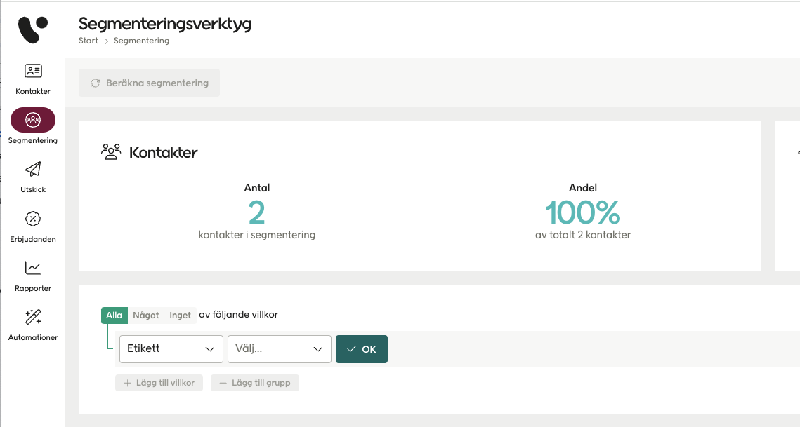
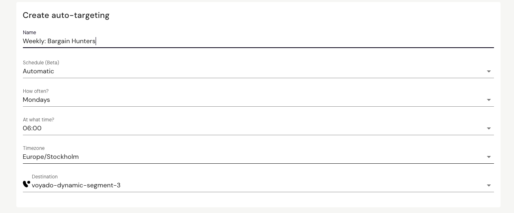
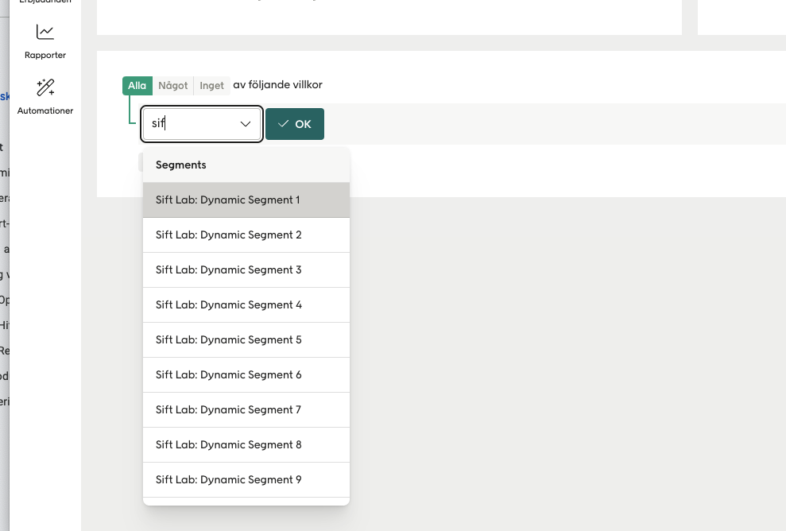
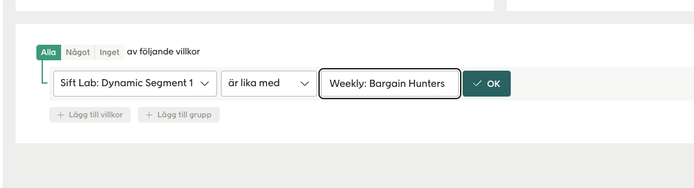
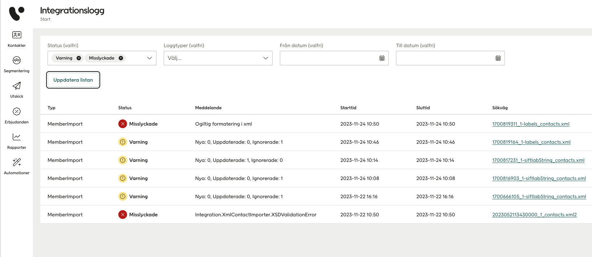
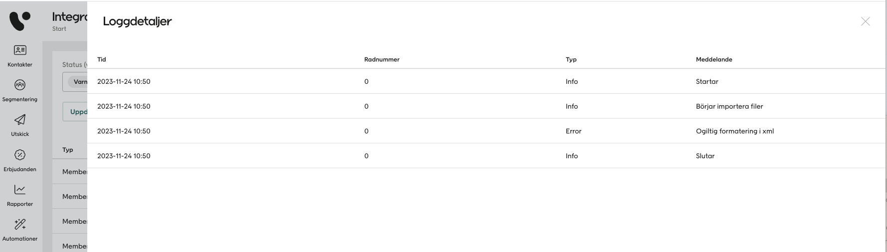

# Exports

## Voyado
In Voyado, you have the option to leverage segments from Sift Lab for a variety of activities, including emails, marketing automation, SMS marketing, and social pushing to Instagram, Facebook, and Google. Segments can be easily exported from Sift Lab to Voyado, where they will be available in two different formats depending on the use case.

These are

* __Customer attributes__: Used for dynamic segmentations, i.e segments saved as `Scheduled: Automatic`, that are updated periodically, for example daily or weekly. Values are set on predefined attributes in Voyado with names like 'Sift Lab: Dynamic Segment 1', 'Sift Lab Dynamic Segment 2', and so on, depending on the segmentation.
* __Labels__: Used for one-time segmentations, such as for one-off campaigns.

To successfully export segments to Voyado, you must apply filters on users to ensure they meet the following criteria: they exist in Voyado, they are not deleted, and they can receive communication in the desired channel.

Exported segments usually becomes visible in Voyado within five to ten minutes depending on size. If this does not happen, please refer to the Troubleshooting section for more information.

### Filters
To export segments to Voyado, a filter on users is required based on the targeted channel:

* `Status email in (Active)` or `Status sms in (Active)`

This ensures that the user is not deleted, has consent, and can receive communication in the chosen channel.

Depending on your Voyado environment, you may also need a user filter on contact type to export segments, both for one-time segmentations and dynamic segmentations. Typically, a segmentation is filtered on contact types `member` and `contact`. For more information about the required contact types for your setup, please contact support@siftlab.com.

* `Contact type in (member, contact)`

It is also common to add filters on country depending on your business model.

Here is an example of user fliters applied to a segmentation.

### Labels (etiketter)
When a segmentation is exported as labels in Voyado, they are available under Segmentation / Labels and can be filtered in Voyado's segmentation tool under 'Labels'.

{:height="50%" width="50%"}

The name of the label consists of the name of the segment in Sift Lab and a unique ID. Every time a segmentation is exported, a new label is created, and old labels are not changed.

Please note that when a segment is exported as a label to Voyado, it has no connection to the segment in Sift Lab. Updates in Sift Lab do not affect the segment in Voyado, and vice versa.

### Customer attributes
Dynamic segmentations, which are segments saved as 'Scheduled: Automatic' and updates regularly, are exported as attributes on customers in Voyado. The attributes are string fields where the value is set to the name of the segmentation in Sift Lab. There are ten attributes available by default: 'Sift Lab: Dynamic Segment 1', 'Sift Lab: Dynamic Segment 2', etc. More can be added as needed.

Selecting a destination in Sift Lab means selecting the attribute for export and is made in the settings for the segmentation. Only one segmentation can use a specific attribute. Therefore, only the attributes that are not used by anyone else are selectable.

The attributes can be filtered in the segmentation tool in Voyado and can be easily found by searching for, for example, 'sift'.

By setting a condition that the value of the field should be the same as the name of the segmentation, users belonging to the segment are filtered out.

### Troubleshooting
If an exported segmentation does not appear in Voyado within 30 minutes, check Voyado's integration log and filter by type 'MemberImport'. You can find the log under Administration / Integration Log.

Click on a row to see more details about what caused the failed import.

Contact support@siftlab.com and attach any error messages from the integration log related to exports from Sift Lab.
