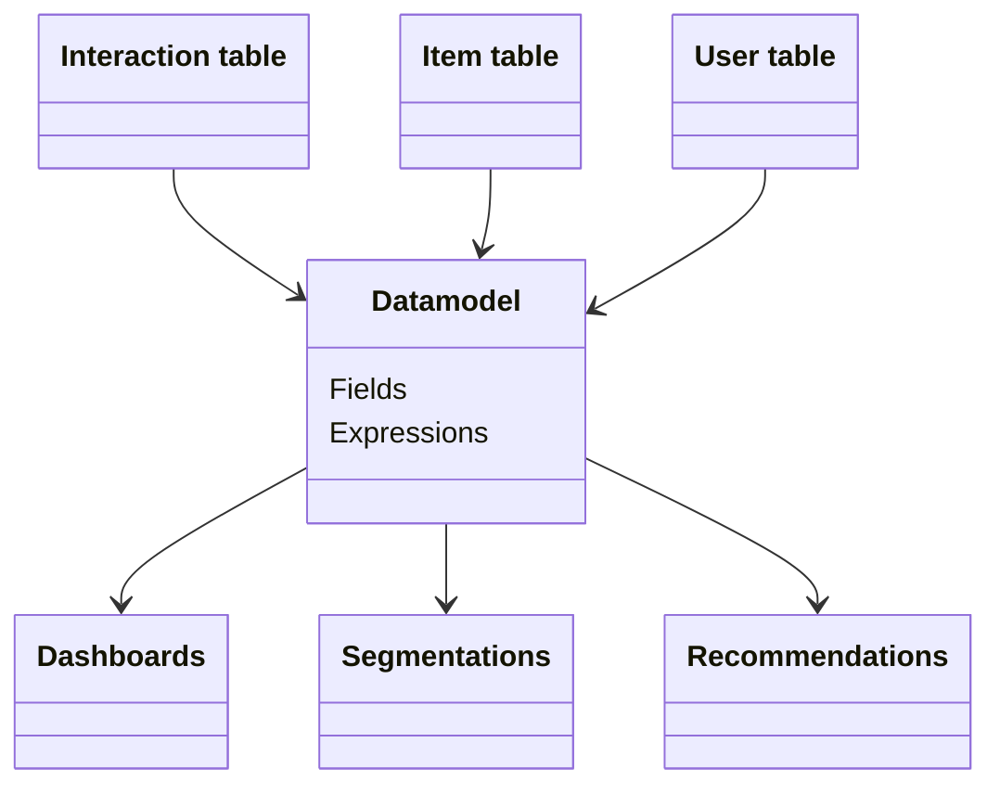

## What is a datamodel? 
A datamodel is made up of of 3 tables (from the sources):

* Interaction table
* User table 
* Item table 

Each line in the interaction table is linked to a user and an item in the item and user table. When we have chosen what sources should be our interaction, item and user tables we can create a datamodel. After this we can start creating additional information through expressions. These can later be used in dashboards (dashboards are based upon a datamodel).

When a datamodel is used for email analysis, the interaction becomes a specific `email sent to a user`, the user becomes `the one receiving the email`, and the email that was sent is treated as an item.

## Edit a data model
To edit and see the detailed info about a data model, you need to edit it. You can edit it by clicking the "pen" either after clicking the data model, or in the data-models list, see images below.

# Interaction config

The interaction table specifies info about the interaction (a user interacting with an item) that includes a timestamp (ts). An interaction config can look something like below:

### Fields

#### field
This is the name of the given in the source query (it can not be changed in the data model).  

#### alias
By adding an alias the the field name is replaced by the alias name in the dashboard and segmentation.
In Recommendation the field name is allways shown even if an alias is added.

#### role
**Categories**  
`Categories` is used when data is made up of multiple `category`'s. The data format for `categories` has to be [`category1`;`category2`;`category3`;`etc`]

**Revenue**  
Revenue can only be set on 1 field and should be `sales price (EX VAT)`. The reason you set mark your `sales price (EX VAT)` with the revenue role is to generate suggested revenue related expressions.

**Quantity**  
If a user buys multiple items of the same SKU at the same time this will be either represented as **1** interaction row with quantity `x` In this case that field should be set to `Quantity`. for some data souces this will be represented as `x` interaction rows without a quantity row.

**Timestamp**  
The timestamp role should only be set to the field that represent the interaction timestamp (when the interaction took place). other timestamps such as `return date` etc. should instead be set to number.  
The timestamp role is needed to create suggested expressions.

**User**  
The User role is set to the key-field that connects the interaction table to the user table.

**Item**  
The Item role is set to the key-field that connects the interaction table to the Item table.

**Number**
The Number role is automatically set to all fields that only contains numbers (you can make toFloat(`field`) without error).
The number role lets you interact with a field as a number meaning you can make an calculation expressions such as if(`field` > 100). 
If you want to make a histogram you can only use fields with role **Number** because you specify the `bin width` wich can only be done if the field is concidered a Number (does not work if the field is a **Category**).

**Category**  
All fields that can not be classified as a **Number** are classified as a **Category**. **Category**'s are used in for example [Bar charts](https://github.com/infobaleen/customer-success/blob/main/Documentation/Platform/Analytics/Dashboards.md "Open: Dashboards").

**Enum**  

**EnumCategories**  

#### Active
The Active toggle button lets you activate/deactivate a field. a deactivated field can not be used in dashboards.

#### Info

Click here to see some data from the table.

### Interaction Expressions

# Item config

The item table specifies info about the items, i.e. the products.

### Fields

#### field
same as in Interaction  

#### alias
same as in Interaction  

#### role
**Categories**  
same as in Interaction  

**Timestamp**  
The timestamp lets you work with unixtimestamp and shows the result in as a datetime (readable format).  

**Format**  
The format role represent the name of the item and is what is shown in the [Image grid](https://github.com/infobaleen/customer-success/blob/main/Documentation/Platform/Analytics/Dashboards.md "Open: Dashboards") in the dashboards and in the [Recommendations](https://github.com/infobaleen/customer-success/blob/main/Documentation/Platform/Recommendations/Recommendation-profiles.md "Open: Recommendation profiles")  

**Image**  
The image role represent what field will be shown as a image in the [Image grid](https://github.com/infobaleen/customer-success/blob/main/Documentation/Platform/Analytics/Dashboards.md "Open: Dashboards") in the dashboards and in the [Recommendations](https://github.com/infobaleen/customer-success/blob/main/Documentation/Platform/Recommendations/Recommendation-profiles.md "Open: Recommendation profiles").
The image field is usually called something with `url`.  

**Number**  
same as in Interaction  

**Category**  
same as in Interaction  

**Enum**  

**EnumCategories**  

#### MLMeta
The MLMeta toggle button controles what is returned when when you make an API call. This is to give you control what data you want to return to the customer. you dont want to activate MLMeta on all fields because this will result in you return alot of "trash columns" to the customer that they have to filter in turn get the relevant data. [Note that you also have to select the role `Image` and `Format` for the product to show]
(MLMeta is only relevant in the recomendations view)

#### MLFilter
The MLFilter lets you write expressions and filter your data in in the [Recommendations](https://github.com/infobaleen/customer-success/blob/main/Documentation/Platform/Recommendations/Recommendation-profiles.md "Open: Recommendation profiles"). You should only activate MLFilter for the fields you actually want to create a filter for, the reason for this is that when you activate **MLFilter** for a field this will store all data in the memory and every time the API calls for a recommendation the datamodel have to itterate through all fields with **MLFilter** resulting in a bad performance on the customers side (when the customer want to load our recomendations on their site the load speed will depend on how many **MLFilters** you have activated.  

#### Active
Same as in Interaction  

### Item Expressions

## User config

The user table specifies info about the users, i.e. the customers. 

### Fields

#### field
same as in Interaction  

#### alias
same as in Interaction  

#### role
**Categories**  
same as in Interaction  

**Timestamp**  
same as in Items  

**Pll**  

**Email**  

**Number**  
same as in Interaction  

**Category**  
same as in Interaction  

**Enum**  

**EnumCategories**  

### User Expressions

#### Persona
The Persona toggle button controles what columns are used in the recommendations. For example, if we activate the field `gender` as a Persona, the recommendation engine will base the recommendations on what gender the user has. If we active the field `age` it will be used as a dimension in the recommendation, and so on.

**Note:** Use a maximum of 2 columns to define persona. Alternatively, make sure that the cardinality (number of groups) is less than 1000. (ex gender: 2 different and cities: 500 different, which means `2*500 = 1000` groups)

## Custom properties
Great feature with good UX **BUT**
only works for a specific preprogrammed examples (RFM, CustomerLifcycle).  

## Expression syntax (Click house)

`SUM()` Summarize a value, for example SUM(returned_quantity) returns the total amount of returned quantity (over chosen period of time) 

`uniq()` counts the amount of unique values, for example uniq(user) returns the amount of unique users.  

`uniqExact()` Is almost the same as uniq(), however uniq() may have a very small inaccuracy (that most often doesn't matter at all), but if it's important to have for example 100.002 (correct) instead of 100.000, use uniqExact(). The reason for this is simply that uniq() is less demanding.

`countIf()` this counts +1 for each time an argument is correct on an interaction (row). `Example`: let's say there's 10 interactions (ten rows) in a table with a column that's currency. On 7 of the 10 rows the currency column consists of 'SEK', if we now use countIf(currency = 'SEK') we will get the value 7.  

`sumIf()`  
sumIf(Value that will be summarized when, X = N)  `Example`: sumIf(revenue, currency = 'SEK')  

`uniqIf()`

multiIf(boolean, result_1, boolean, result_2, ..., boolean, result_n, else_this)  
multiIf(name = 'red', colour, name = 'big', 'size', 'no data')

## Data model expression examples 

### Interaction expression

**Days since previous order cohort**  
multiIf (agg.daysFromPrev <=30,'1.<30', agg.daysFromPrev <=60,'2.30-60', agg.daysFromPrev <=90,'3.60-90', agg.daysFromPrev <=180,'4.90-180', agg.daysFromPrev <=360,'5.180-360', agg.daysFromPrev <=720,'6. 360-720', agg.daysFromPrev <=4000,'7.>720', '8.New')

**Has return**  
multiIf(returned_quantity > 0, 'Return', 'No return')

**First order (month**  
toStartOfMonth(user.agg.first)

**Active week**  
toMonday(ts)

**Active month**  
toStartOfMonth(ts)

**% discount**  
SUM(full_price-revenue)/SUM(full_price)

**Revenue**  
SUM(revenue)

**Price per item**  
SUM(revenue)/SUM(quantity)

**Revenue per user**  
SUM(revenue)/uniq(user)

**Average order value**  
SUM(revenue)/uniq(user,ts)

**Sold items**  
SUM(quantity)

**Items per order**  
SUM(quantity)/uniq(user,ts)

**% returned quantity**  
SUM(returned_quantity)/SUM(quantity)

**LTV 30d**  
We usually do 5 different LTV metrics, just remember to change name accordingly to selected amount of days  

sumIf(revenue, ts < user.agg.first + 30 AND addDays(user.agg.first, 30) <= now())/uniqIf(user,addDays(user.agg.first, 30) <= now())  
sumIf(revenue, ts < user.agg.first + 60 AND addDays(user.agg.first, 60) <= now())/uniqIf(user,addDays(user.agg.first, 60) <= now())  
sumIf(revenue, ts < user.agg.first + 90 AND addDays(user.agg.first, 90) <= now())/uniqIf(user,addDays(user.agg.first, 90) <= now())  
sumIf(revenue, ts < user.agg.first + 180 AND addDays(user.agg.first, 180) <= now())/uniqIf(user,addDays(user.agg.first, 180) <= now())  
sumIf(revenue, ts < user.agg.first + 365 AND addDays(user.agg.first, 365) <= now())/uniqIf(user,addDays(user.agg.first, 365) <= now())  

**Returned quantity**  
SUM(returned_quantity)

**Returned or not returned**  
multiIf(returned_quantity > 0, 'Return', 'No return')

### Item expressions  
Sold items [item based dashboards]  
SUM(article_number.agg.trans)  

Available quantity [item based dashboards]  
SUM(item.in_stock)  

SUM(full_price-PriceExVatIncDiscSEK)/SUM(full_price)   
SUM(DiscountSEK) / SUM((DiscountSEK + PriceIncVatIncDiscSEK)  

### User expressions

**Users > 1 order**  
uniqIf(user,user.agg.orders>1)/uniq(user)
