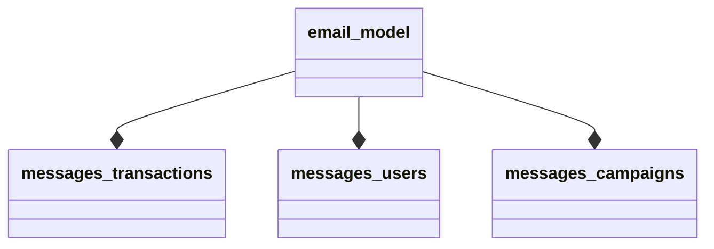

# Create sources
When the [data is imported](https://github.com/infobaleen/customer-success/blob/main/Documentation/Platform/Menu/Manage%20Data/Import%20Files.md), go to `Manage Data -> Sources` and create a new source by clicking the purple plus sign as seen in the below image. 

1. Name the source `import_[source of data]_[type of data]` where `[source of data]` specifies where the data comes from (centra, voyado, etc), and the `[type of data]` specifies the data type (items, users, interactions, etc). 


2. Choose an identifier for the source using the `Id columns` field.  If the source you’re creating is for:
    * **interactions**: we want to identify each interaction through a user, an item and the time of the purchase, therefore choose user,ts,item under id columns and then press create.
    * **items**: we want to identify each item by using an item id (often sku or variant). 
    * **users**: we want to identify each user by using a user id. 

The fields `Comment` and `Merge Filter` can be left empty, and you can press `CREATE`. 

3. Choose database connection and create a `QUERY` 
If it’s a centra/voyado customer choose that option, if the files were uploaded manually, choose imports.

You can now see the query stage, as standard ```“SELECT * FROM `*`”``` will show, if you press “EXECUTE PREVIEW SUMMARY” you will see all the imported files you can choose to gather data from. Copy the filename you want to use and enter that name in the query above, like `SELECT * FROM [ENTER FILENAME HERE]`.

Copy the queries (depending on what system the customer has) from here:

* [Centra queries](https://github.com/infobaleen/customer-success/wiki/Manage-Data#centra-queries)
* [Voyado queries](https://github.com/infobaleen/customer-success/wiki/Manage-Data#voyado-queries)

The import file is now done, press sync and save to exit. 

4. Now repeat the "Create source"-step 2 but name the file `model_[source of data]_[type of data]` (the use same identifier as in the import file). 
    * In the `Choose database connection` now choose `source` instead, and press `execute preview summary`, now choose the import source file and edit the query to select from that, like "`SELECT * FROM ENTER_SOURCENAME_HERE`" and then press `Save and sync`.


# Frontpage columns


## Name
Name of source


## id
every source has an unique id wich is used to show dependencies between sources.


## Cnf Version


## Count
Count describes how many rows the source have. There can only be 1 row for every unique key column. if there are multiple rows with the same key all but 1 is removed.


## Tags
you can tag a source to keep track of how it is used.


## Drivers
The drivers show whatdriver is used and also if it is active (green) or inactive (red). If a source has multiple queries there will be multiple drivers, here you can see wich source is active and wich are not.


## Sync
You can set a daily sync for the source, for example `DailyAt:6`.


## Dependencies 
Dependencies for a source show what other sources the are used to build up the source.  
an example for this is 
```
SELECT * FROM Source1  
LEFT JOIN Source2 on Source2.id = Source1.id  
UNION  
SELECT * FROM Source3  
```
This will show the id for source 1,2,3 in the Dependencies for the new source.


## Updated At
Shows how long ago the source was last modified.


## Synced At
Shows how long ago the source was last synced.


# Top Menu


## Delete


## Tag
Select a source, click Tag and write a new tag or select an old tag.


## Migrate


## Truncate
Trucate wipes the source of all data. This is usefull if you have changed key column for example because if you just sync the data the old data is not removed. 
[Note that some sources only read 1 week data at the time to save time, if you truc a source like this all historic data is removed wich is bad]


## Sync
Manually syncs the source.


## Enable
doesnt work


## Disable 
doesnt work


## Create
Creates a new source.


# Source settigs


## Name
Just a name


## Id columns 
The Id columns has to be choosen to be unique. if the id is not unique (the same id for many rows) only 1 row will be saved and all others are removed.  
For the interaction table the id has to contain user AND id or ts,item. The reason user has to be an id column is because when user is the first id column all interactions are sorted on user first. this lets you use expressions such as agg.i wich count number of interactions a user has made. if the interaction table is not sorted on user first the aggregation functions doesnt work.  
For multiple id columns they are sorted in the order they are written.
User,ts,item is sorted first on user, then on ts and lastly on item.  

SELECT CUSTOM COLUMNS is usefull if you want other names than the predefined such as SKU.


## RunEvery
Set a sync


## Comment


## Merge filter 
lets you filter out your query before you save it.

A Merge filter discards everything that is not true before saving the table. For example if you add a query similar to `toFloat(ts) > now()-100*24*3600`, then all timestamp (ts) data from later than 100 days will be discarded.


# Overview
Shows what is in the source currently


# Query


## Database connection


## Load saved query
lets you reload previously run queries


## Preprocessor directives
when importing data from a link such as product feed you need to add preprocessor directives to know how to read the file.  
```
SELECT * FROM `url:https://files.channable.com/o2lQPJiYXk7KrY1DW2BJ3A==.xml`  
```
[Note that you have to write **url:** before https://]  

start by writing  
`decoder=xml`  
to show the file structure, in this case it looks like this.


**decoder:** describes what file format, xml, csv, json etc.  
**root:** navigates the file and shows where you want to read data.  
**rowtag:** selects the object.  
**pluck:** inside your rowtag you can have multiple data columns, pluck lets you choose wich you want to get.  

Below is one example with `root=feed.channel` and one example with `root=rss.channel`:


In the first image example, the resulting preprocessing directives to fetch the feed are:  

`decoder=xml`  
`root=rss.channel`  
`rowtag=item`  
`pluck=google_product_category,price`  
resulting in this outcome


# Query expressions
you need to enclose variable names that contain other characters than letters and numbers with `backticks` ` `,  
this includes whitespace ' ', dot '.', etc...


## create a custom source
SELECT * FROM `raw: 
id,item
1,item1
2,item2`
this returns a table.


## UNION 
A UNION merges two data sources by including all unique rows from both. When making a union the columns need to have the same name and be in the same order
```
SELECT * FROM `table 1`
UNION
SELECT * FROM `table 2`
```
if you have overlapping id rows in `table 1` and `table 2` the id in `table 1` will be saved and `table 2` will be discared.
ex. 
to try this, create a test source
```
select 
incr(1,50) AS id,
'table 1' AS item
from `<RANDOM_SOURCE>`

UNION
select 
incr(1,1) AS id,
'table 2' AS item
from `<RANDOM_SOURCE>`
```
then create a new source 
```
SELECT * FROM `<TEST_SOURCE>`
```
this will show that all overlapping ids will have item from `table 1`.

A UNION can also be suffixed by ALL, where UNION ALL will not discard duplicates, meaning much faster execution but leaves duplicate rows if they exist.

## INSERT INTO
insert into lets you create multiple tables in the same query that you can use to create a UNION or LEFT JOIN.
```
INSERT INTO <table_name>
SELECT * FROM `<source_name>`
;
``` 
The `;` is needed to mark where the table end. 
When using the table you created with INSERT INTO you use the <table_name> not the <source_name>
ex.
```
LEFT JOIN <table_name> ON <table_name>.id = XXX.id
```
## LEFT JOIN
LEFT JOIN lets you append more columns to an existing table 

## firstSeen()
firstseen(<field>) saves only the first encountered row for 

coalese

toFloat()

unixTimestamp()

## split() and slice() and slicestr()

These expressions can be used to edit strings, see an example below:

```        
Insert into a
SELECT * FROM `raw:
a   b
1   ABCDE`
;

SELECT 
    a AS a,
    split(b,'') AS step1,
    slice(split(b,''),0,3) AS step2,
    replace(slice(split(b,''),0,3),',','') AS step3,
    length(b),
    slicestr(b,1,2)
FROM a
```

The result will be:
```
a	step1	     step2.     step3	 length(b)    slicestr(b, 1, 2)
1	A,B,C,D,E.   A,B,C	ABC	 5            BC
```
	


	


# Query solutions
## Connect historic and new data that has overlapping transactions, items and users.




## create a custom user.agg.<field>
the datamodel creates aggregate functions such as user.agg.revenue.
to create one yourself do the following.
In the below example I create `user.agg.margin` similar to `user.agg.revenue`
	
```
--aggregates margins per user same as user.agg.revenue but with margin
INSERT INTO margin
SELECT
	user AS user,
	concat('',SUM(margin)) AS total_margin
FROM `s3 - transactions`;
	
SELECT 
UI.user AS user,
margin.total_margin AS total_margin,
UI.other fields...
FROM `user_import` AS UI
	
LEFT JOIN margin ON margin.user = UI.user
```
Note that you need to add `concat('',)` to the sum expression.
this is because you cant LEFT JOIN a float. `concat('',)` converts it into a string.
`concat('',SUM(margin)) AS total_margin`
	
# Standard Queries


## Centra Queries
_____________________________________________________________________________________________________________________
Procedure	1

Interactions	1

Items	2

Users	3

_____________________________________________________________________________________________________________________


### Procedure
Setup config
Make arbitrary query toward centra
This will trigger proxy sync, the .gz files will appear once completed, duration 1-5h
_____________________________________________________________________________________________________________________


### Interactions  
Id columns: id i import / user,id i model source

```
SELECT  
  `line.Id` AS id,
  `order.Customer.Id` AS user,
  unixTimestamp(`order.OrderDate`, '2006-01-02T15:04:05-0700') AS ts,  
  concat(`line.ProductVariant.Id`,'_',`line.ProductSize.Size.Id`) AS item,  
  toFloat(`line.LineValue.FormattedValue`)*toFloat(`order.CurrencyBaseRate`) AS revenue,  
  round(`line.Quantity`*`order.CurrencyBaseRate`*`line.UnitOriginalPrice.FormattedValue`,2) AS full_price,  
  `line.ProductVariant.Id` AS variant_id,  
  `line.ProductVariant.Product.Id` AS product_id,  
  `line.ProductVariant.VariantNumber` AS variant_number,  
  `line.ProductSize.Id` AS product_size,  
  `line.ProductSize.SKU` AS size_sku,  
  `line.ProductSize.SizeNumber` AS size_number,  
  `line.ProductSize.GTIN` AS size_gtin,  
  `line.ProductSize.Size.Id` AS size_id,  
  `line.ProductSize.Size.Name` AS size_name,  
  toFloat(`line.LineValue.FormattedValue`) AS Non_converted_value,  
  `line.UnitPrice.FormattedValue` AS Unitprice_formatted_value,  
  `line.UnitOriginalPrice.FormattedValue` AS Unit_original_price_formatted_value,  
  `line.Quantity` AS quantity,  
  `line.ReturnedQuantity` AS returned_quantity,  
  `line.CancelledQuantity` AS cancelled_quantity,  
  `line.ProductNumber` AS product_number,  
  `line.TypeName` AS type,  
  round(`line.DiscountPercent`,0) AS discount_percent,  
  `line.TaxPercent` AS tax_percent,  
  `order.Id` AS order_id,  
  `order.Number` AS order_number,  
  unixTimestamp(`order.CreatedAt`, '2006-01-02T15:04:05-0700') AS order_created_at,  
  `order.Status` AS order_status,  
  `order.GrandTotal.FormattedValue` AS total order value inc VAT,  
  `order.Shipments[0].CarrierInformation.ServiceName` AS carrier_service_name,  
  `order.Shipments[0].CarrierInformation.CarrierName` AS carrier_name,  
  `order.Market.Name` AS order_market,  
  `order.Store.Name` AS store,  
  `order.Country.Name` AS country,  
  `order.PaymentMethod.Name` AS order_payment_method,  
  `order.Totals.LineValues` AS order_totals_values,  
  `order.Totals.Shipping` AS order_total_shipping,  
  `order.Totals.Discounts` AS order_total_discounts,  
  `order.Totals.Handling` AS order_totals_handling,  
  `order.CurrencyBaseRate` AS order_currency_base_rate,  
  `order.Discounts` AS order_discounts,  
  `order.Discounts.Len` AS order_discounts_len,  
  `order.DiscountsApplied.Name` AS discount_name,  
  `order.DiscountsApplied.Method` AS order_discounts_applied_method,  
  `order.DiscountsApplied.Value` AS order_discounts_applied_value,  
  `order.DiscountsApplied.Discount.Codes` discount_codes,  
  Currency AS currency,  
  CurrencyOK AS currency_ok  
FROM`interactions.gz`  
```
_____________________________________________________________________________________________________________________


### Items
Id columns : item
```
SELECT
	concat(`variant.Id`,'_',`variant.productSize.Size.Id`) AS item, 
	`prod.Name` AS prod_name,  
	`variant.MediaURL` AS variant_media_url,  
	`variant.Id` AS id,  
	`variant.Name` AS variant_name,  
	`variant.Status` AS variant_status,  
	`variant.StockOffset` AS variant_stock_offset,  
	`variant.InternalName` AS variant_internal_name,  
	`variant.variantNumber` AS variant_variant_number,  
	`variant.UnitCost.FormattedValue` AS variant_unit_cost_formatted_value,  
	`variant.productSize.Id` AS variant_product_size_id,  
	`variant.productSize.GTIN` AS variant_product_size_gtin,  
	`variant.productSize.SizeNumber` AS variant_product_size_size_number,  
	`variant.productSize.SKU` AS variant_product_size_sku,  
	`variant.productSize.Size.Id` AS variant_product_size_size_id,  
	`variant.productSize.Size.Name` AS variant_product_size_size_name,  
	`prod.Id` AS prod_id,  
	`prod.ProductNumber` AS prod_product_number,  
	`prod.Brand.Name` AS prod_brand_name,  
	`prod.CountryOfOrigin.Name` AS prod_country_of_origin_name,  
	`prod.Collection.Name` AS prod_collection_name,  
	`prod.Status` AS prod_status,  
	`prod.HarmonizedCommodityCode` AS prod_harmonized_commodity_code,  
	`prod.Folder.Name` AS prod_folder_name,  
	`display.Store.Name` AS display_store_name,  
	`display.Status` AS display_status,  
	`display.Name` AS display_name,  
	`display.DisplayItem.Id` AS display_display_item_id,  
	`display.Categories` AS display_categories,  
	`display.Category1` AS display_category_1,  
	`display.Category2` AS display_category_2,  
	`display.Category3` AS display_category_3,  
	`display.CategoryUri` AS display_category_uri,  
	`display.Uri` AS display_uri,  
	`variant.productSize.Size.AvailableNowQuantity` AS variant_product_size_size_available_now_quantity,  
	`variant.Price` AS variant_price,  
	`variant.Currency` AS variant_currency,  
	`variant.Campaign_DiscountPercent` AS variant_campaign_discount_percent,  
	`variant.Campaign_FixedPrice` AS variant_campaign_fixed_price,  
	`variant.Campaign_FixedPrice_Currency` AS variant_campaign_fixed_price_currency,  
	market AS market,  
    
      concat(`prod.Brand.Name`, ', ', `prod.Name`,   
         if(`variant.Name` != '' OR `variant.productSize.Size.Name` != '', ' ', ''),  
         if(`variant.Name` != '', concat('[',`variant.Name`, ']'),''),  
         if(`variant.productSize.Size.Name` != '', concat('[',`variant.productSize.Size.Name`,']'), '')   
         ) format
FROM `items.gz`
```
_____________________________________________________________________________________________________________________


### Users
Id columns : user
```
SELECT  
`customer.Id` AS user,  
	`customer.IsAnonymized` AS anonymized,  
	`customer.TotalOrders` AS total_orders,  
	unixTimestamp(`customer.CreatedAt`, '2006-01-02T15:04:05-0700') AS created_at,  
	unixTimestamp(`customer.UpdatedAt`, '2006-01-02T15:04:05-0700') AS updated_at,  
	`customer.Store.Name` AS store,  
	`customer.Email` AS email,  
	`customer.CellPhoneNumber` AS phone  
FROM `users.gz`  
```
_____________________________________________________________________________________________________________________


### No size model 
for Item source called ‘no size model - items’
```
SELECT 
	variantId AS id,  
    groupcoalesce(format) AS format,  
	groupcoalesce(productName) AS product_name,  
    groupcoalesce(variantName) AS variant_name,  
	groupcoalesce(variantStatus) AS variant_status,  
    groupcoalesce(brand) AS brand,  
    groupcoalesce(`prod.Folder.Name`) AS prod_folder_name,  
    groupcoalesce(collection) AS collection,  
    groupcoalesce(productNumber) AS product_number,  
    groupcoalesce(price) AS price,  
    groupcoalesce(availableNowQuantity) AS available_now_quantity,  
    groupcoalesce(countryOfOrigin) AS country_of_origin,  
    groupcoalesce(mediaURL) AS media_url,  
    groupcoalesce(unitCost) AS unit_cost,  
    groupcoalesce(productStatus) AS product_status,  
    groupcoalesce(variantInternalName) AS variant_internal_name,  
    groupcoalesce(displayCategory1) AS display_category_1,  
    groupcoalesce(displayCategory2) AS display_category_2,  
    groupcoalesce(displayCategory3) AS display_category_3,  
    groupcoalesce(displayItemId) AS display_item_id  
 
FROM `centra_products_import`  

GROUP BY variantId  
```
_____________________________________________________________________________________________________________________


### Example rows with explanation

Coalesce (`display.Name`, `prod.Name`, `variant.Id`) AS format 
Explanation: Choose display.Name if it exists, otherwise check prod.Name, and lastly variant.Id.  

Concat (`line.ProductVariant.Id`,'_',`line.ProductSize.Size.Id`) AS item 
Explanation: This will merge the two lines, for example Concat (Hello, '_', you) would concat to Hello_you 

unixTimestamp (`order.CreatedAt`, '2006-01-02T15:04:05-0700') AS order_created_at, 
	Explanation: This will convert a date into number form 
_____________________________________________________________________________________________________________________


## Voyado Queries
___
Procedure	1

Items	2  

Users	3

Interactions	4  
___


### Procedure
Setup config
___


### Interactions
```
SELECT
	*
FROM
	`items.gz`
```
___


### Items
```
SELECT
	*
FROM
	`items.gz`
```
___


### Users
```
SELECT
	*
FROM
	`items.gz`
```
___


## Google Feed Query


### Procedure

Get the link to the customer's Google feed (link to a .xml file), this is something most customers can easily supply upon request. Usually, there are multiple feeds to cover all different markets. The link to a specific market is a URL like *https://some.domain/api/feed/google_se/SOMEKEY* 


### Import Query

```
SELECT
    *
FROM `url:GOOGLE_FEED_LINK`
```


### Preprocess Directives

In the Preprocessor Directives field, set the xml properties as follows. There may be other useful field to include in the `pluck` line as well.

```
decoder=xml
root=rss.channel
rowTag=item
pluck=id,title,image_link,availability,price,sale_price,google_product_category,product_type,brand
```

**Note:** Stray Ampersands are currently not accepted, but Google handles these. If you get errors with this, you can read feeds with non-escaped ampersands using this as the first line in the preprocessor:

```
preprocess=[["replace","&",""]]
```


