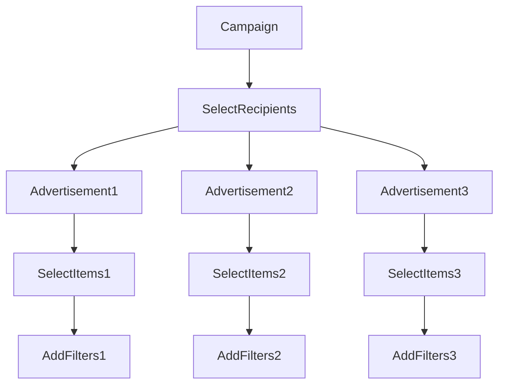

## Auto-targeting

Auto-targeting identifies optimal combinations of items and users that helps increase conversion in campaigns. The results are based on the results from the machine-learning models. 

The result is groups with recommended users-items combinations to use in the advertisements, see the overview below:

### Step 1: Initiate auto-targeting campaign

1. Choose the **Auto Targeting** tab
2. Create a new auto-targeting campaign by clicking the + icon in the upper right corner
3. Name the auto-targeting model (in the image below `Auto-targeting test`), and choose the maximum number of recipients for the campaign. 
    * Note that `Available recipients` indicates the total number of users that exists in the data

### Step 2: Choose recipients 
After the campaign has been created, now it's time to set the recipients (audience) for the campaign.

4. To filter the data for various campaigns, click the filter icon to the right of the user icon

5. Choose a filter according to your needs. In the below image, users have been filtered to contains those with age 20-25 that are registered in Sweden.

### Step 3: Create advertisements 

6. To set up an advertisement click the + icon under the auto-targeting card. 

7. Name the advertisement and click the + icon and `Select items to target`

This will trigger some settings to pop up above. 
  * **ignore already consumed**: used to block so that users do not end up in a campaign that they already bought from. For example, if you have a campaign including Product1 and a user has already bought that product, then you may want to make sure that the user can not end up in a campaign inlcuding that product. 
  * **Trend**: If you choose a high trend value, then seasonal trends in sales will have higher weight (e.g. during Christmas more Santa Claus-products are probably sold)
  * **Item.multiplier (?) and Recipient multiplier (?)**: These can be ignored. The idea is that you can weight the score for a user or item. Ex: item.price, or user.propensity for item resp. user. But it is experimental and seldom used. 

8. Now you can choose to add how many items to include in your advertisement, and what filters should apply. You can also add additionalt filters for the recipients. When ready, press `Save and Run`. 

9. The result will look similar to the image below. You can see the products included in the advertisement, the number of recipients, and an average recipient score and its distribution. The recipient score is a value from 0 to 1, where 1 indicates a very strong match between the user and the advertisement. In this case, a recommendation would be to only use the first 30% recipients or so in the advertisement, since the scores for the long tail of users is low. 

# Clustering

Clustering makes it possible to group users and items into a specified number of clusters. For finding cluster, there are three different algorithms that can be used:
1. `embedding` with item clusters from the trained machine-learning model and users assigned to the most connected cluster,
2. `plsa`, [Probabilistic Latent Semantic Analysis](https://en.wikipedia.org/wiki/Probabilistic_latent_semantic_analysis) run separately, and
3. `modularity`, network-based [modularity optimization](https://en.wikipedia.org/wiki/Louvain_modularity)run separately.

`embedding` is the fastest method since it uses the trained machine-learning model.

