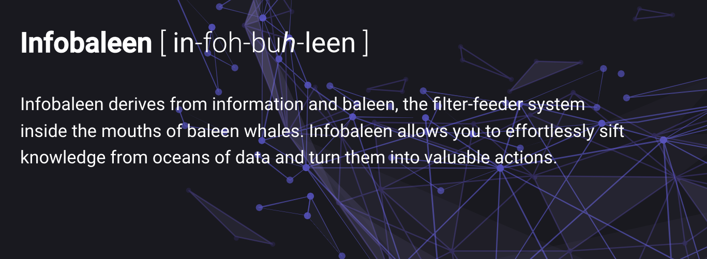

# Welcome to the docs!

| Analytics      | Segmentations   |    Recommendations                    |
| ----------- | -----------------| ------------------- |
| Gain insights on your business from our interactive and customizable dashboards by diving deep into your trove of data. Learn what drives your new customers, find out what makes your customers churn, explore your clusters and segments and much more.    <a href="https://infobaleen.github.io/Platform/Analytics/Dashboards/">Dashboards &#187;</a>    | Make powerful segmentations for your marketing campaigns and export your results directly to your CRM-system or a marketing tool like Facebook Ads or Google Ads. Target specific products and let our machine learning model segment users optimally according to products you want to sell and your campaign goals.    <a href="https://infobaleen.github.io/Platform/Segmentations/Auto-targeting/">Auto-targeting &#187;</a> <a href="https://infobaleen.github.io/Platform/Segmentations/Clustering/">Clustering &#187;</a> | Use personalized product recommendations in your marketing to make your products relevant at all times. Add them on your landing page, in your checkout flow or use them to automate your email content. Create customizable API profiles with filters and rules based on your product meta data, and apply them to different use cases. Ex one for your landing page, one for your user browse sessions and one for your email content.    <a href="https://infobaleen.github.io/Platform/Recommendations/Overview/">Recommendations &#187;</a> |